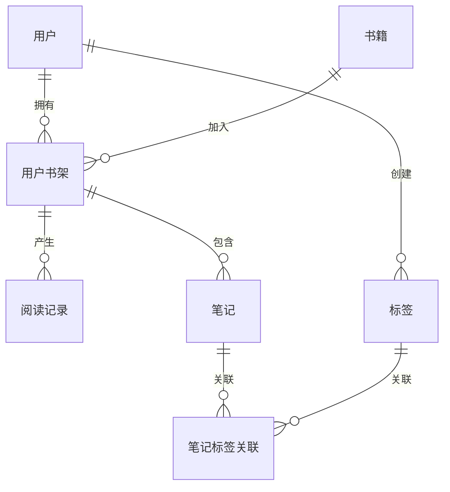

# 数据库设计

## ER 图

```mermaid
erDiagram
    用户 ||--o{ 用户书架 : 拥有
    书籍 ||--o{ 用户书架 : 加入
    用户书架 ||--o{ 阅读记录 : 产生
    用户书架 ||--o{ 笔记 : 包含
    用户 ||--o{ 标签 : 创建
    笔记 ||--o{ 笔记标签关联 : 关联
    标签 ||--o{ 笔记标签关联 : 关联
```
