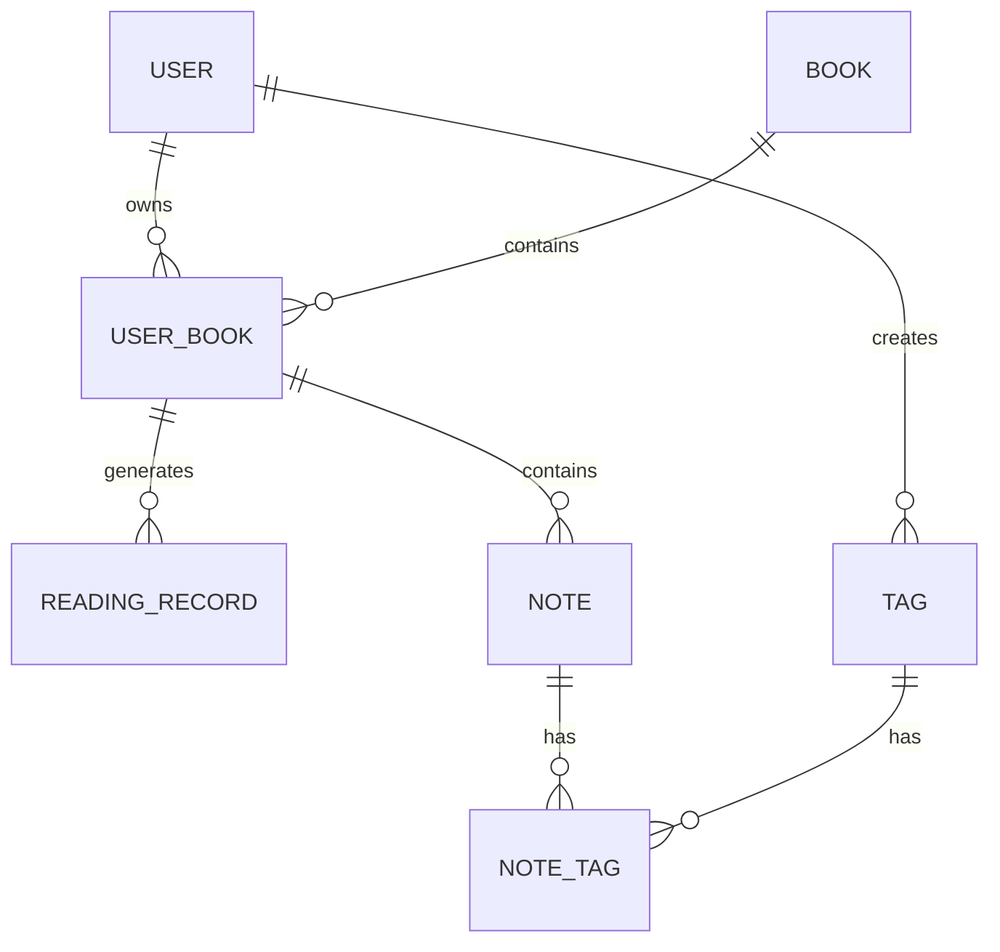

# 数据库设计

## ER 图

```mermaid
erDiagram
    USER ||--o{ USER_BOOK : owns
    BOOK ||--o{ USER_BOOK : contains
    USER_BOOK ||--o{ READING_RECORD : generates
    USER_BOOK ||--o{ NOTE : contains
    USER ||--o{ TAG : creates
    NOTE ||--o{ NOTE_TAG : has
    TAG ||--o{ NOTE_TAG : has
```

## 实体中文说明

| 实体 | 中文名称 |
|---|---|
| USER | 用户 |
| BOOK | 书籍 |
| USER_BOOK | 用户书架 |
| READING_RECORD | 阅读记录 |
| NOTE | 笔记 |
| TAG | 标签 |
| NOTE_TAG | 笔记与标签关联 |
